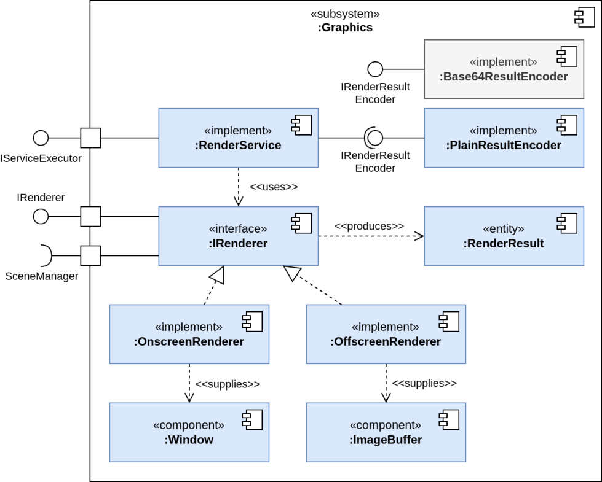

# Image Generation for stimulating sensors

The graphics subsystem of Hive is responsible for generating images from a 3D scene. It is built on top of the Vulkan
API and uses the [Vulkan Scene Graph (VSG)](https://vsg-dev.github.io/vsg-dev.io/) library to manage the scene graph and
rendering pipeline. The graphics subsystem is designed to be highly scalable and can be distributed across multiple
devices to generate images in parallel by installing a [Rendering Service](\ref hive::graphics::RenderService) in the
Hive.

use cases include:

* Generate images of a virtual environment for training machine learning models or stimulating sensors in the
  simulation (e.g. for robotics applications).
* Distribute the image generation process across multiple GPUs or machines to generate images of different view angles
  in parallel.
* Visualize simulation outputs in real-time using a 3D scene.

## Graphics Subsystem Architecture

This subsystem must both supply human and non-human users, like simulation models of missiles running on a dedicated
computer, with synthetic images. Therefore, there are two implementations of
the [IRenderer](\ref hive::graphics::IRenderer) interface:

* [OnscreenRenderer](\ref hive::graphics::OnscreenRenderer): Renders images to a window for human users.
* [OffscreenRenderer](\ref hive::graphics::OffscreenRenderer): Renders images to a buffer for network transfer,
  feeding them into an computer-vision algorithm, or stimulating a simulation model. It does not spawn a window.

To offer rendering capabilities to the Hive and possible distribute the image generation workload,
the [RenderService](\ref hive::graphics::RenderService) has been established. It returns the rendered image as byte
array to the caller.

The [SceneManager](\ref hive::scene::SceneManager) (from the Scene Subsystem) manages the scene graph and provides an
interface to add and remove
objects. Supplied to the graphics subsystem, it renders the managed scene.

