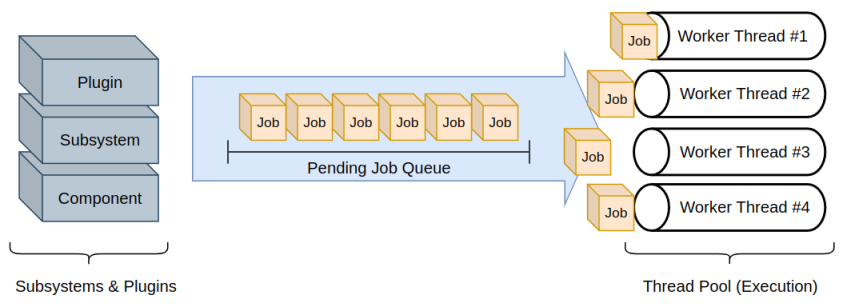
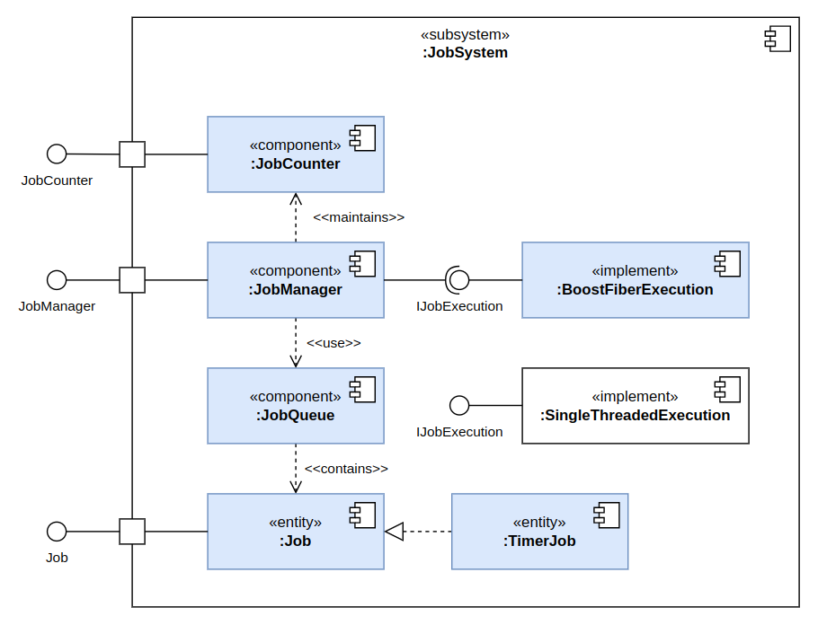

# Job System

[TOC]

The job-system has the following features:

* Schedules and processes jobs issued by higher-level subsystems and plugins in parallel.
* Schedule timed jobs, which are executed after a certain time. This can be used for periodic tasks or delayed
  execution.
* Offers synchronization tools like barriers, called job-counters in this context, to synchronize jobs and wait for
  their
  completion.
* Offers a non-blocking programming paradigm by using **cooperative context switching** mid execution.



## Everything-is-a-Job Paradigm

In Hive, everything is a job. Every workload is scheduled as a job and processed in a parallelized manner. This is more
efficient than sequential processing and state-of-the-art in various real-time systems:

* **Game Engines** like _Unreal_ or _Naughty Dog Engine_ require job-systems to process all events, rendering tasks, and
  logic realistic game worlds cause in real-time.
* **Real-Time Operating Systems** often use job-systems to process tasks and events in parallel to
  not violate deadlines and real-time constraints.

Currently, Hive does not guarantee hard real-time constraints, but the performance boost is handy either way.

## The Job Execution Cycle

> **TL:DR**: The job system operates in cycles, processing jobs in distinct phases—Init, Main, and Clean-Up—to prevent
> synchronization issues by ensuring resources are properly allocated, used, and cleaned up in an orderly sequence.

The job-system works in **cycles**. When a new cycle is invoked, it processes all collected jobs in parallel in
different phases. Each job can be assigned one of these phases:

* **Init Phase**: Jobs that allocate or prepare resources that could already be used in the current execution cycle.
* **Main Phase**: Jobs that do the main work. This is where the heavy lifting is done.
* **Clean-Up Phase**: Jobs that clean up resources or do other post-processing tasks.

This is done to avoid synchronization problems: If there were no phases, one job could use a resource before it has been
made accessible by another one. Or one job could clean up a resource before another one has finished using it.
Therefore, these operation are strictly seperated in different phases of the execution cycle.

## Non-Blocking Paradigm using Context Switching

### Blocking vs. Non-Blocking

> **TL;DR**: Hive uses a non-blocking approach that allows jobs to pause and resume. The system continues
> processing other tasks without getting stuck while waiting for responses, which is crucial for real-time and
> distributed systems.

Usually, when we wait for a service response or a job to finish, we need to block the current thread. In real-time
software and distributed systems, this causes a lot of problems. If we had 4 execution threads, for instance, we could
only wait for 3 service responses at a time without blocking the entire system. In short: We don't want that.

Hive offers a non-blocking programming paradigm by using cooperative context switching. This means that a job can yield
at any time mid-execution. The worker thread then stashes the jobs state (registers, stack, etc.) and continues with the
next job. This way we don't need to wait for a service response or job to finish, but can continue processing other jobs
while we _wait_. This is essential for real-time systems and distributed systems.

### Context Switching

> **TL;DR**: Native thread operations are expensive and don’t support efficient context switching. Hive uses a custom
> context switching mechanism with lightweight fibers or coroutines, allowing jobs to pause and resume efficiently
> without relying on costly native threads.

Native threads do not support context switching. They are managed by the operating system and are expensive to create
and destroy. Hive uses a custom context switching mechanism to switch between jobs without wasting cpu-cycles. This is
more lightweight and allows for more fine-grained control over the execution of jobs in Hive.

When a job yields, the worker thread stashes the jobs state (registers, stack, etc.) and loads back the state of the
next one. This is usually done using some assembly code and is very efficient. We then don't speak of threads, but of
so-called **fibers** or **coroutines**. Basically, a native worker-thread schedules these fibers and switches between
them when needed.

### Waiting for synchronization primitives

Usually we need to _wait_ (yield) for the following things:

* `std::future` when waiting for an asynchronous task to finish.
* `mutex` or `condition_variable` when waiting for a resource to be available.
* a `JobCounter` when waiting for a job or set of jobs to finish.
* a duration of time to pass.

The job-system offers the `Await` function for that purpose.

```cpp
// -- wait for future inside a job --
std::future<Result> future_result = async_task();

// this is NOT asynchronous, don't do it!
// std::future.wait();

job_manager->Await(future_result); // yields until future has resolved
Result result = future_result.get();

// -- wait for other job inside a job --
std::shared_ptr<Job> other_job = std::make_shared<Job>(...);
std::shared_ptr<JobCounter> other_job_counter = std::make_shared<JobCounter>();
other_job->AddCounter(other_job_counter);
job_manager->KickJob(other_job);

// this is also pure evil, so I don't want to see it in your jobs
// while (!other_job->IsFinished()) {}

job_manager->Await(other_job_counter); // yields until other job has finished

// -- wait for a duration of time inside a job --
job_manager->WaitForDuration(5s);

// -- wait for a mutex inside a job --
jobsystem::mutex mtx; // do not use std::mutex, they block
std::unique_lock<jobsystem::mutex> lock(mtx); // will yield under the hood. No need to call Await
```

## Synchronous vs. Asynchronous Jobs

> **TL;DR**: In each cycle, synchronous jobs must finish before moving to the next phase, while asynchronous jobs can
> finish later. Synchronous jobs are best for quick, simple tasks. Asynchronous jobs work well for longer, more complex
> tasks.

Every job is started when a new execution cycle is invoked, but some are waited for, while others are not.

* **Synchronous** jobs must finish in the same cycle's phase they have been started in. Therefore, the cycle cannot
  advance to the next phase (e.g. from Init to Main) until all jobs of the current phase have completed. It waits for
  these jobs.
* **Asynchronous** jobs are started in the current cycle but can finish in a later cycle. The cycle can advance to the
  next phase even if these jobs are not finished yet. It does not wait for these jobs.

Therefore, jobs can be made asynchronous, but it is not advisable for every job:

* **Short-term**, **lightweight**, and **non-blocking** jobs should be made synchronous.
* **Long-term**, **heavyweight**, and **blocking** jobs should be made asynchronous. These could be service requests,
  which are known to last a longer time, like entire simulation requests in Monte-Carlo simulations.

## Job System Architecture



The job system comprises of the following components:

* [JobManager](\ref hive::jobsystem::JobManager): Manages the job queue and cycle execution phases. It does not execute
  jobs itself, but merely organizes
  their execution.
* [IJobExecution](\ref hive::jobsystem::execution::IJobExecution): Executes jobs as soon as they're passed to it. It
  controls the
  worker threads and their context
  switching. By default, it uses
  the [BoostFiberImplementation](\ref hive::jobsystem::execution::impl::BoostFiberExecution)
  implementation, which utilizes the `boost::fibers` library.
* [Job](\ref hive::jobsystem::Job): Represents a single job. It can be synchronous or asynchronous. It can be assigned
  to a phase and a priority.
  It can also be extended to support more complex behaviors, like [TimerJob](\ref hive::jobsystem::TimerJob).

## Important Notes when using the Job System

While the job system offers many advantages and features, it **introduces concurrency to the entire core system**
because jobs are always executed in parallel. Using`jobsystem::mutex` and locks becomes necessary for all higher-level
components that have shared data. **Remember the _Everything-is-a-job_ Paradigm**.

There are some exceptions to this rule, where job executions cannot interfere due to different phases in the execution
cycle:

* A plugin's init and shutdown functions


