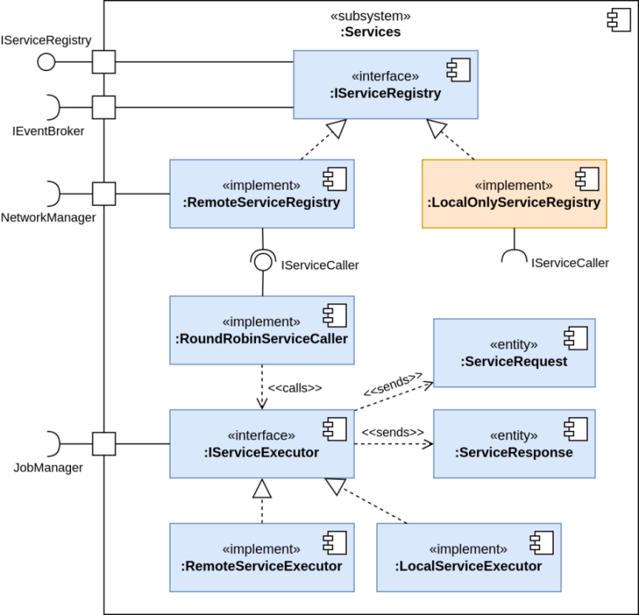
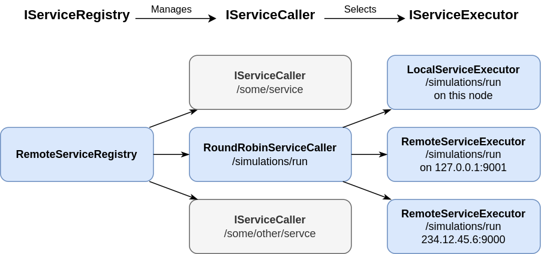
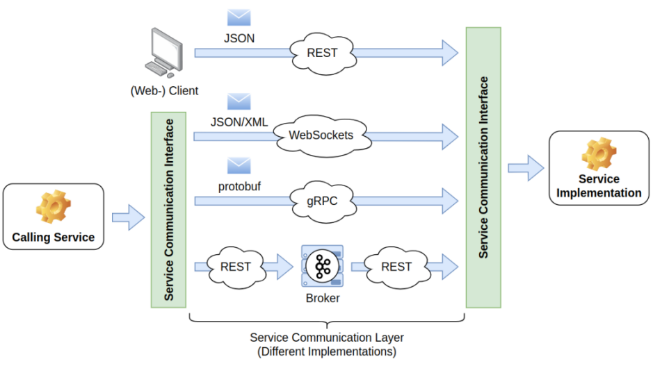
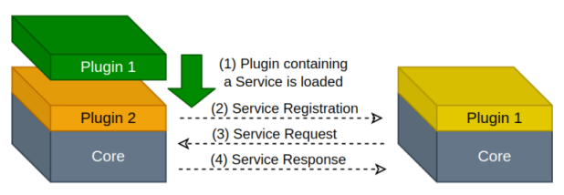

# Service Infrastructure

[TOC]

## Key Features and Goals

* Offer local services to other nodes in the hive
* Request remote services from other nodes in the hive
* Discover offered services in the hive
* Not bound to a specific protocol, transmission format, or service registry to adapt to future technologies.

## Introduction to Services

> **TL;DR**: A service in Hive has a name, a function (functor) that executes when called, input parameters (
> ServiceRequest), and output results (ServiceResponse), all linked by a Transaction ID. Services can be:
> * Local (executed on the same node) or Remote (executed on a different node).
> * Singular (offered by one node) or Duplicate (offered by multiple nodes).
> * Unlimited (handling many requests at once) or Limited (handling one or few requests at a time).
> * Synchronous (blocking, executed immediately) or Asynchronous (non-blocking, runs in the background).

### Basic Service Attributes

A service consists of

* A **service name** (e.g. `monte-carlo/simulation/execute`), similar to the url of a REST service. All services with
  the same name should offer the same functionality.
* A **service functor**, which is executed when the service is requested. It can be located on the same node or on a
  remote node.
* A set of **input parameters** that the service function uses to produce a response. They are wrapped in
  a [ServiceRequest](\ref hive::services::ServiceRequest).
* A set of **output results** that the service function produces as a result. They are wrapped in
  a [ServiceResponse](\ref hive::services::ServiceResponse).

[ServiceRequest](\ref hive::services::ServiceRequest) and [ServiceResponse](\ref hive::services::ServiceResponse) are
bound together by the **Transaction Id**.

### Service Types

We can distinguish services based on their location:

* **Local Services** are services that are executed on the same node that offers the service. They are executed by the
  [LocalServiceExecutor](\ref hive::services::impl::LocalServiceExecutor).
* **Remote Services** are services that are executed on a remote node. They are executed by the
  [RemoteServiceExecutor](\ref hive::services::impl::RemoteServiceExecutor).

Or based on their frequency in the hive:

* **Singular Services** are services that are only offered by one node in the hive. They are unique.
* **Duplicate Services** are services that are offered by multiple nodes in the hive. They are redundant and the
  caller can choose which node to call using various scheduling strategies.

Or based on their concurrency level and capacity:

* **Unlimited Services** can execute an unlimited number of requests concurrently. This works well for small, stateless
  services that require little to no resources.
* **Limited Services** can only execute one or a limited number of requests concurrently. This works well for services
  that require a lot of resources or are stateful, like entire simulations that require a lot of computing resources.

Or based on their execution mode:

* **Synchronous Services** are services that are executed immediately and block the job execution cycle of
  the [JobManager](\ref hive::jobsystem::JobManager). In most cases they are small and have short completion times.
  Otherwise they would block the job execution cycle.
* **Asynchronous Services** are services that are executed in the background and do not block the job execution cycle of
  the [JobManager](\ref hive::jobsystem::JobManager). They are used for long-running services that require a lot of
  resources and time to complete.

## Components

To offer and request services in the hive, the service infrastructure uses the following components:

* [Service Executors](\ref hive::services::IServiceExecutor) spawn a job that either executes the service (which is
  basically a function pointer) locally or forwards the request to another node. Hence, there are
  the [LocalServiceExecutor](\ref hive::services::impl::LocalServiceExecutor) and
  the [RemoteServiceExecutor](\ref hive::services::impl::RemoteServiceExecutor) types. Each executor refers to a
  specific
  service provided on a dedicated node.
* [Service Callers](\ref hive::services::IServiceCaller), like
  the [RoundRobinServiceCaller](\ref hive::services::impl::RoundRobinServiceCaller),
  are used to choose the next [Service Executor](\ref hive::services::IServiceExecutor) to call. Remember that each
  service
  can be offered multiple times on the same node and in the same hive by different nodes. Each caller implementation
  employs a strategy to select the next one. It basically resolves the `1:n` relationship between a service name and its
  executors.
* The [Service Registry](\ref hive::services::IServiceRegistry) is used to discover offered services in the hive. It
  allows nodes to query for services by name and to get a [Service Caller](\ref hive::services::IServiceCaller) that can
  requests the service. It can be extended to support third-party service registry technologies and infrastructures.

## Exchangeable Service Infrastructure Protocols, Formats, and Registries

The service infrastructure allows offering and requesting services in the hive. Services can be requested by other nodes
in the hive. By default, it uses simple messaging between nodes (
using [IMessageEndpoint](\ref hive::networking::messaging::IMessageEndpoint)), but
the [IServiceRegistry](\ref hive::services::IServiceRegistry) interface can
be extended to support third-party service registry technologies and infrastructures.

## Service Registry Implementations

At first, a node must discover a service to request it from its follow nodes. There are multiple ways how this can be
implemented using the [IServiceRegistry](\ref hive::services::IServiceRegistry) interface:

* **Broadcasting**: A node sends a message to all other nodes in the hive, asking for a specific service. This is the
  most straight-forward way to implement, but also the one with the most overhead. This implementation has been omitted.
* **Service Registration**: A node notifies its fellow nodes once about a service it offers. This is how
  the [PeerToPeerServiceRegistry](\ref hive::services::impl::PeerToPeerServiceRegistry) implementation works.
* **Centralized Registry**: A central service registry is used to store all services offered by all nodes in the hive.
  This introduces a single point of failure, but can also be more efficient. This is not yet implemented.
* **Distributed Registry**: A distributed registry is used to store all services offered by all nodes in the hive. This
  is more fault-tolerant than a centralized registry, but also more complex. This is not yet implemented. It could be
  implemented using a distributed database.

### Peer-to-Peer Service Registry

As already explained, a node forwards the registration of
a [LocalServiceExecutor](\ref hive::services::impl::LocalServiceExecutor) to its directly connected nodes. It also
transmits a list of offered services, once a connection to a new node has been established. This way, each node knows
about the currently offered services of its direct peers.

